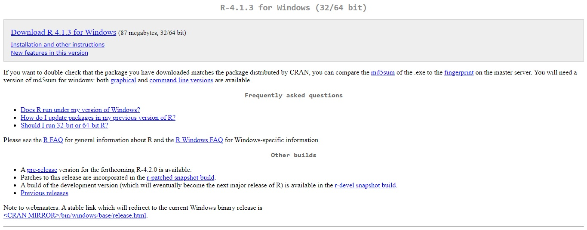
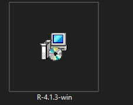
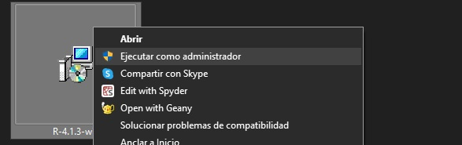
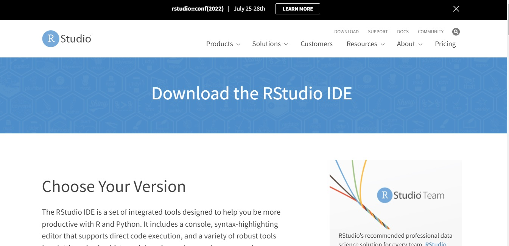
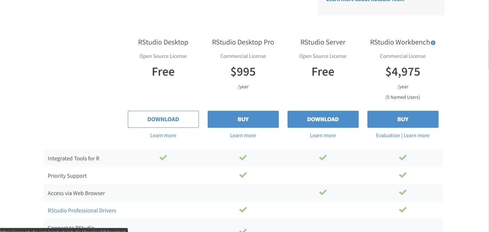
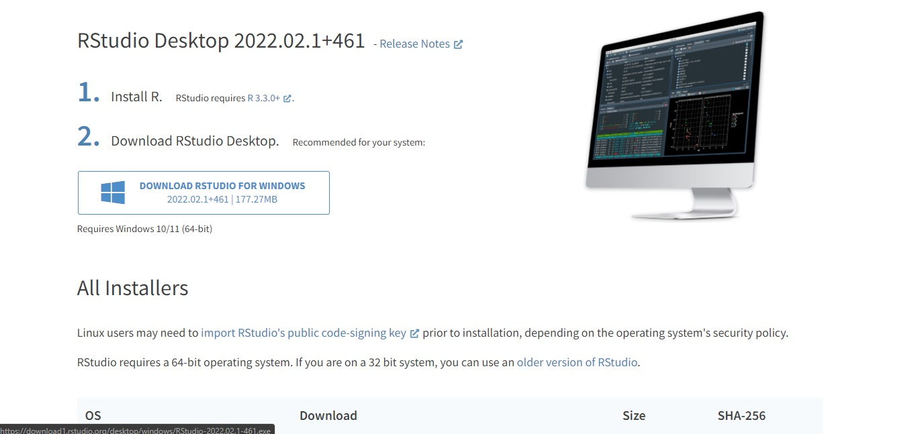
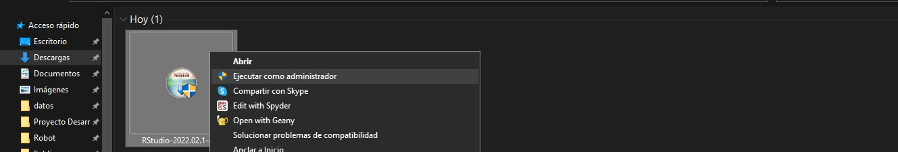

# Practica 1. Instalación de R y RStudio
## 1. Instalación de R
### ** Primero vamos a la pagina donde está el archivo de instalación**{width=width height=height}
### ** Nos dejará un archivo de instalación**  {width=100% height=height}
### ** Y ejecutamos este archivo como administrador**  {width=width height=height}
  

## 2. Instalación de RStudio
### ** Primero vamos a la pagina oficial de RStudio**  {width=width height=height}
### ** Después elegimos la versión de RStudio que deseamos instalar**  {width=width height=height}
### ** Despues descargamos el archivo ejecutable de instalación**  {width=width height=height}
### ** Ejecutamos el archivo de instalación como administrador y comenzará el programa de instalación **  {width=width height=height}

  
  
  
